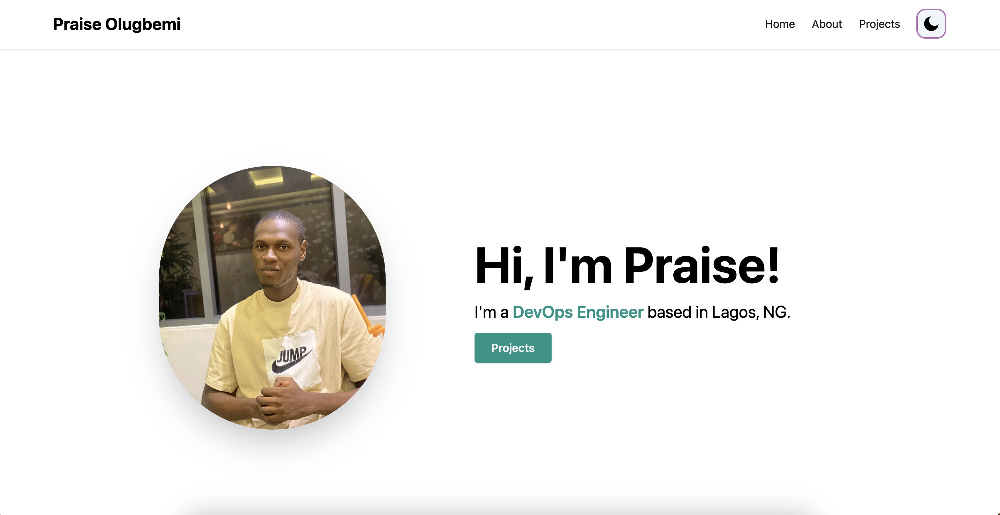

# Docker Containerization and Deployment

## Building and Deploying a Node.js App with Amazon ECS



--

## Step 1: Set Up the Node.js App

Create a new directory for your project:
```
mkdir node-app
cd node-app
```

Create a `package.json` file with your Node.js app's dependencies.

Write your Node.js app code in a file like app.js.

--

## Step 2: Containerize the App with Docker

1. Create a Dockerfile in your app directory (same level as app.js):
```
FROM node:latest

WORKDIR /app

COPY package*.json ./

RUN npm install

COPY . .

EXPOSE 3000

CMD ["npm", "run", "dev"]
```

2. Build the Docker image:
`docker build -t node-app .`

--

## Step 3: Push Image to Registry (Amazon ECR)
1. Create an ECR repository using AWS CLI:
`aws ecr create-repository --repository-name node-app`

2. Login Docker to your ECR registry:
`aws ecr get-login-password --region us-east-1 | docker login --username <username> --password-stdin <password>`

3. Tag your Docker image:
`docker tag node-app:latest <aws-account-id>/node-app:latest`

4. Push the image to ECR:
`docker push <aws-account-id>/node-app:latest`

*** Remember to name correctly.
NB: Values used in documentation differs from values in source code.

## Step 4: Deploy App with Amazon ECS
1. Create a new Amazon ECS cluster and a service in the AWS Management Console.

2. Create a task definition with your container image from ECR.

3. Configure the service to use the task definition and set up scaling, AWS cloudwatch and application load balancing.

4. Launch your ECS service.

*** Application Load balancing will generation a DNS for us to be able to access the running app on AWS ECS.
We can take it a step further and reroute a custom DNS to the application load balancer URL.

## Step 5: Monitoring & Testing.
1. Monitor your service in the ECS Dashboard.

2. Access the public DNS of your load balancer to test your deployed Node.js app.

